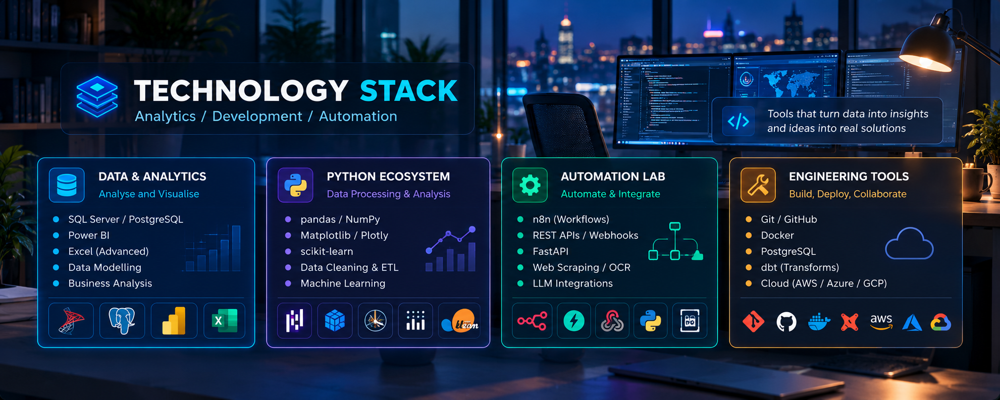
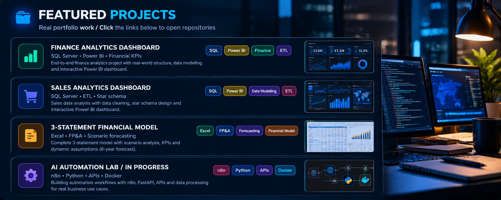
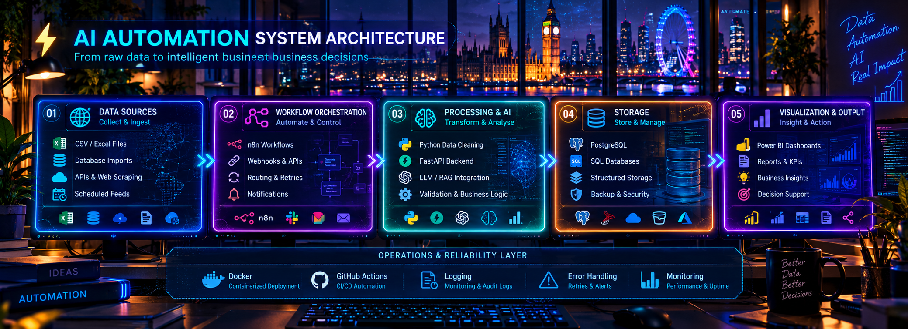
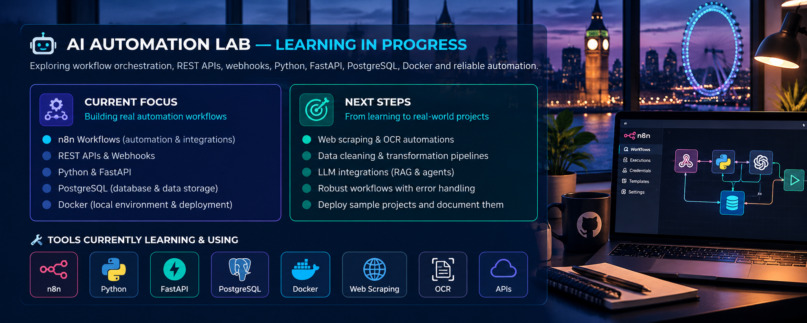

### Financial Analytics | Business Intelligence | Process Automation

Economics graduate with a background in accounting, financial reporting and business data analysis.

I combine **financial knowledge, data analytics and automation** to transform complex business data into reliable reporting, actionable insights and more efficient workflows.

Currently expanding my capabilities in **AI automation, Python-based data processing, APIs and intelligent business systems**.

---

## 💼 Professional Focus

My work connects three complementary areas:

| Financial Analytics | Business Intelligence | Business Automation |
|---|---|---|
| Financial Modelling | SQL Data Analysis | Excel & Power Query Automation |
| FP&A and Forecasting | Power BI Dashboards | Python Data Processing |
| P&L and Cash Flow | Data Cleaning & ETL | n8n Workflows |
| Budget vs Actual | Data Modelling | REST APIs & Webhooks |
| Variance Analysis | KPI Reporting | Database Integration |
| Financial Reconciliation | Business Insights | Workflow Optimisation |

**My objective:** Help businesses reduce manual reporting, improve data accuracy, understand financial performance and make better decisions.

---

## 🧰 Technology Stack

### Data Analytics & Business Intelligence

**Core tools:** SQL Server, Python, pandas, NumPy, Power BI, DAX, Power Query, Excel, Matplotlib and Plotly.

### Financial Analytics & Modelling

`Three-Statement Modelling` `FP&A` `Financial Forecasting`

`Budget vs Actual` `Variance Analysis` `Cash Flow`

`Financial KPIs` `Scenario Analysis` `Reconciliation`

### Automation & Data Engineering

**Currently developing:** n8n, PostgreSQL, Docker, REST APIs, webhooks, JSON processing, OCR, FastAPI and LLM-assisted workflows.

---

## ⭐ Featured Portfolio Projects

### 🏦 01. Bank Branch Reporting Automation

**Financial Reporting | Excel | Power Query | Automation**

A banking-oriented financial reporting and automation portfolio project focused on transforming source data into structured, repeatable and analysis-ready reports.

**Key focus areas:**
- Data extraction and transformation
- Financial reporting workflows
- Automated data preparation
- Consistent reporting structures
- Reducing repetitive manual processing
- Supporting financial analysis and management reporting

**Business value:** Demonstrating how repeatable reporting workflows can reduce manual effort, improve consistency and support timely decision-making.

**Technologies:** `Excel` `Power Query` `Financial Reporting` `Automation`

---

### 📊 02. Three-Statement Financial Model & Forecasting

**Excel | FP&A | Financial Modelling | Forecasting**

An integrated financial modelling project connecting the Income Statement, Balance Sheet and Cash Flow Statement.

**Key features:**
- Five-year financial forecasts (2027E–2031E)
- Base, Upside and Downside scenarios
- Revenue and profitability forecasting
- Working capital analysis
- Financial ratios and KPIs
- Monthly budget and forecasting
- Actual vs Budget variance analysis
- Automated financial integrity checks
- Management insights and recommendations

**Business value:** Supporting financial planning, scenario evaluation, profitability analysis and informed financial decision-making.

**Technologies:** `Excel` `FP&A` `Forecasting` `Financial Modelling`

---

### 💰 03. Finance Analytics Dashboard

**SQL Server | Power BI | Financial Analytics**

An end-to-end financial analytics project using SQL Server for data transformation and Power BI for interactive management reporting.

**Key features:**
- Bronze, Silver and Gold ETL architecture
- Data cleaning and validation
- Dimensional data modelling
- Financial KPI calculations
- Revenue and profitability reporting
- Accounts Receivable and Payable analysis
- Budget variance reporting
- Cash position monitoring
- Interactive Power BI dashboards

**Business value:** Transforming accounting and operational data into reliable financial intelligence for management reporting.

**Technologies:** `SQL Server` `Power BI` `ETL` `DAX`

---

### 📈 04. Sales Analytics Dashboard

**SQL Server | Power BI | Business Intelligence**

A sales analytics project transforming raw transactional data into a structured analytical model and interactive dashboard.

**Key features:**
- Data profiling and validation
- SQL-based data transformation
- Star-schema data modelling
- Customer and product analysis
- Revenue and profitability metrics
- Sales performance reporting
- Interactive business intelligence

**Business value:** Helping businesses identify sales trends, monitor performance and support data-driven decisions.

**Technologies:** `SQL Server` `Power BI` `ETL` `Data Modelling`

---

## ⚡ AI & Business Automation

*Reference architecture illustrating my longer-term development direction. Not all components have been implemented or deployed.*

My automation work focuses on connecting business data, applications and reporting systems into efficient, repeatable workflows.

### Current Practical Learning

- Building n8n workflows
- Working with REST APIs and webhooks
- JSON data extraction and transformation
- Integrating PostgreSQL databases
- Python-based data processing
- Docker-based local development
- Conditional logic and workflow execution
- Data validation and automated reporting

### Development Roadmap

- Web scraping and OCR document processing
- Python and FastAPI services
- Error handling, logging and retries
- Workflow security and reliability
- LLM-assisted document processing
- AI agents and intelligent automation
- More advanced end-to-end data pipelines

---

## 🤖 AI Automation Lab

My long-term goal is to develop integrated business systems combining:

**Data Sources → Data Processing → Analytics → Business Reporting → Intelligent Automation**

Potential applications include:

| Finance | Operations | Data Processing |
|---|---|---|
| Financial report preparation | Workflow orchestration | Data extraction |
| Invoice processing | API integrations | Data cleaning |
| Reconciliation workflows | Scheduled reporting | OCR processing |
| Management reporting | Notifications | Database updates |
| Forecasting support | Process automation | Data validation |

*These are areas of development and planned applications, not a claim that every system has already been delivered.*

---

## 🚀 Current Development Priorities

**1. Financial Reporting & Analytics**

Strengthening financial modelling, FP&A, financial reconciliation, forecasting and automated reporting.

**2. Business Intelligence**

Building reliable SQL data pipelines, Power BI dashboards and decision-ready analytical solutions.

**3. Automation Engineering**

Developing practical n8n, Python, PostgreSQL, Docker and API-based workflows.

**4. Intelligent Business Systems**

Working toward combining analytics, reporting automation and AI-assisted processes into scalable business solutions.

---

## 📊 Languages in My Public Repositories

*GitHub language distribution across public repositories, based on file byte counts. Automatically refreshed by GitHub Actions.*

---

## 🐍 GitHub Contribution Activity

---

## 🔥 GitHub Streak & Statistics

---

## 🤝 Let's Connect

I'm interested in opportunities involving:

**Financial Analytics · FP&A · Business Intelligence · Data Analysis · Reporting Automation · Business Process Automation**

I also provide freelance services in financial modelling, Excel reporting, data analysis and business intelligence.

### 👀 Profile Visitors

**Turning financial and business data into insights, reliable reporting and intelligent automation.**

