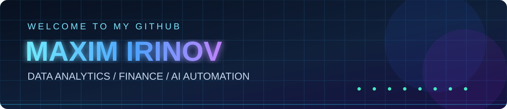
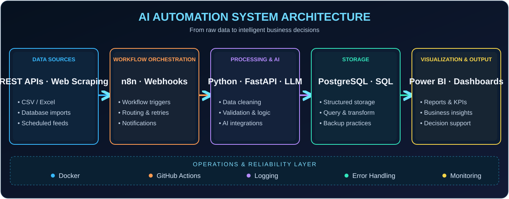
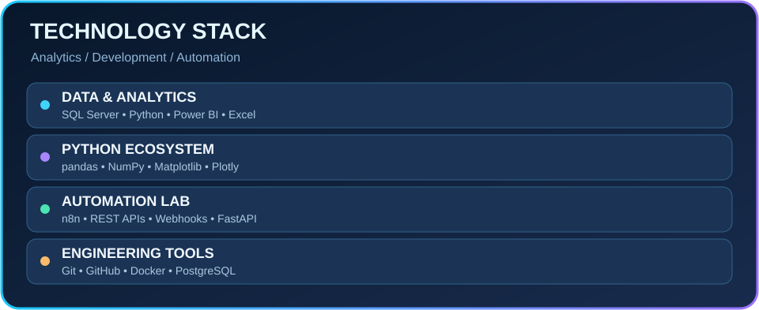
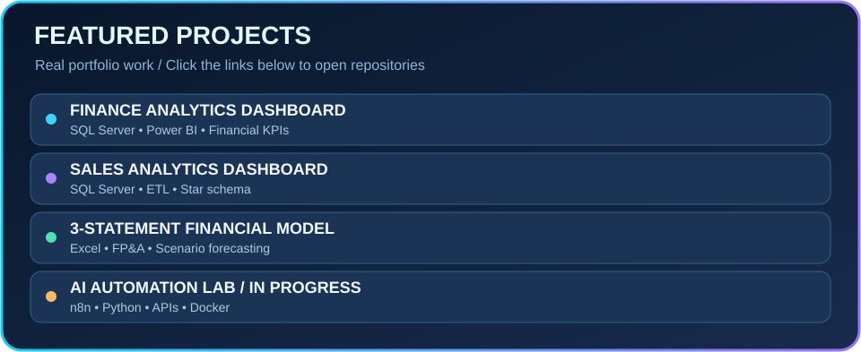
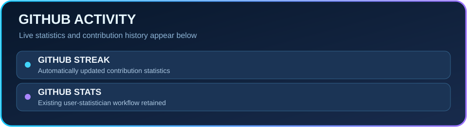
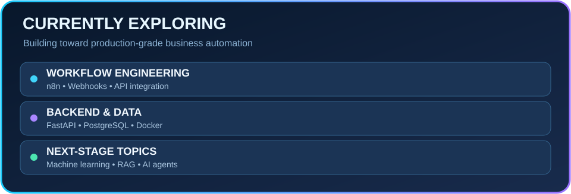

Economics graduate turning complex data into clear financial insights and practical business solutions.  
Building expertise in **AI automation, data engineering and intelligent analytics workflows**.

---

## ⚡ AI Automation System Architecture

*Reference architecture and learning direction — not a claim that every component is deployed in production.*

---

## 🧰 Technology Stack

---

## ⭐ Featured Projects

### 💰 [Finance Analytics Dashboard](https://github.com/maximyellowrock/finance-analytics-dashboard)
End-to-end financial reporting, data modelling, validation and executive-level KPI analysis.  
`SQL Server` `Power BI` `ETL` `Star Schema` `Financial Analysis`

### 📈 Sales Analytics Dashboard
Sales data cleaning, dimensional modelling, SQL analysis and interactive Power BI reporting.  
`SQL Server` `Power BI` `ETL` `Star Schema` `Sales Analytics`  
[Explore repositories](https://github.com/maximyellowrock?tab=repositories)

### 📊 [Three-Statement Financial Model & Forecasting](https://github.com/maximyellowrock/Finance-Model-Forecast-Excel)
Integrated Income Statement, Balance Sheet and Cash Flow Statement, with **2026A–2031E forecasts**, scenario analysis, working capital metrics (DSO / DIO / DPO), financial ratios and reconciliation checks.  
`Excel` `FP&A` `Forecasting` `Budgeting` `Variance Analysis`

### 🤖 AI Automation Lab — Learning in Progress
Exploring workflow orchestration, REST APIs, webhooks, Python, FastAPI, PostgreSQL, Docker and reliable automation patterns.

---

## 📈 GitHub Activity

---

## 🌱 Currently Learning

`n8n Workflows` · `API Integration` · `FastAPI` · `PostgreSQL` · `Data Engineering` · `Machine Learning` · `RAG & AI Agents`

**Goal:** Combine data analytics, finance, business intelligence and AI automation to build intelligent, practical business solutions.

---

### 👀 Profile Visitors

**Turning data into insights. Building toward intelligent automation.**

